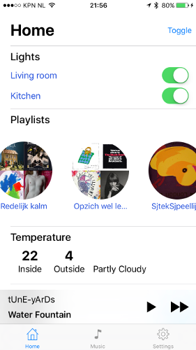
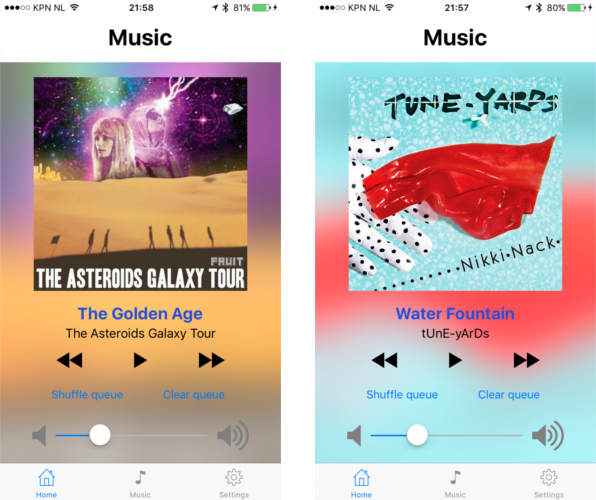
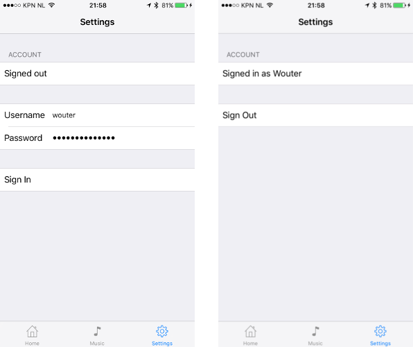
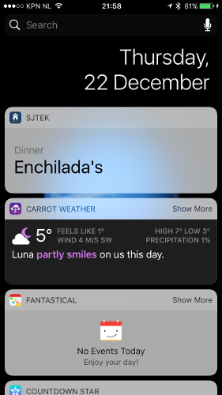
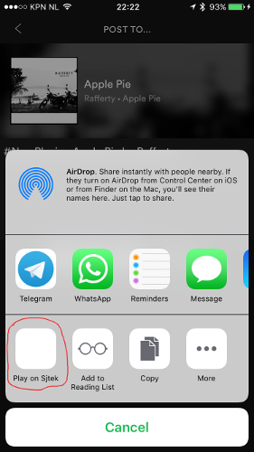
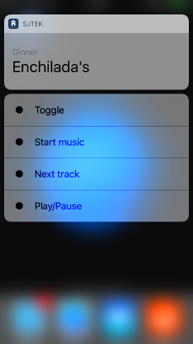

# Sjtek client iOS

*De screenshots zijn in hogere resolutie te vinden in de [screenshots map](../Screenshots).*

##Inleiding
Deze app dient als client voor Sjtek Control. Een zelf gemaakt systeem voor enkele dingen in het huis te automatiseren. De belangrijkste dingen hiervan zijn de lichten, een LED strip, het koffiezet apparaat, de TV, een thermometer in de woonkamer en Mopidy. Mopidy is een headless muziek speler die Spotify, Youtube etc. ondersteund. Dit alles draait op een kleine computer in de woonkamer.

Een overzicht hiervan is hieronder te zien.

## De API
Voor het communiceren heb ik eerder een Java library gemaakt die door de Android app en Raspberry Pi's worden gebruikt. Deze heb ik geport naar Swift zodat deze ook voor de iOS app te gebruiken is en later voor een MacOS app. De klassen hiervoor zijn te vinden in de map `API`.

De communicatie met de API loopt vooral via HTTP GET request.
Voor alle modules zijn endpoints beschikbaar om de onderdelen aan te sturen. Deze endpoints zijn te vinden in de map `API` in de `enum` `Action`. 
Voor sommige endpoints zijn ook URL argumenten beschikbaar. Dit is bijvoorbeeld een gebruikersnaam voor persionalistatie. Deze argumenten worden gemaakt d.m.v. de `Arguments` klasse in de map `API`.

Bij ieder API call wordt de status van alle modules in een grote JSON terug gestuurd. Een voorbeeld van deze JSON is via [deze link](https://sjtek.nl/api/info) te zien.
Om de status van de app gesynchroniseerd te houden wordt een websocket gebruikt om updates van de API te ontvangen. De JSON wordt hierover verzonden zodra er een module wordt gewijzigd.

De websocket en de [info JSON](https://sjtek.nl/api) zijn van buitenaf bereikbaar. Alle andere API calls vereisen Basic Authentication om aangeroepen te worden indien deze van buitenshuis worden benaderd. Hierdoor kunnen ook gasten bij ons de muziek bedienen, mits ze er daadwerkelijk zijn.

Naast de status JSON is er nog een "data" JSON. Deze bevat statische informatie waaronder de afspeellijsten van de gebruikers, aanspreek methodes (voor text to speech). Deze JSON is alleen met authenticatie te benaderen.

De "info" en "data" JSON worden door Gloss geparsed naar Swfit `structs`. Deze zijn te vinden in de map `API/Models`. `Response` is hierbij de "info" JSON en `Settings` de "data" JSON.
Er zit nog een losse struct in voor de suggestie van het avond eten. Dit is een aparte API.

### Interne werking
De API kan worden aangesproken d.m.v. de `API` klasse. Deze statische klasse gebruik Alamofire om met de API te communiceren. Indien de gebruiker is ingelogd wordt dit voor authenticatie gebruikt.

De URL voor de API wordt opgebouwd met de `Arguments` klasse. Hierin wordt de `Action` enum gestopt met het commando voor de API. Alamofire verstuurt dit en krijg (als het lukt) een String terug.

Deze String wordt geparsed tot een `Response` of `Settings` object. Dit wordt via een event bus verzonden. Daarnaast wordt de JSON naar een state manager verstuurd. Over beide later meer.

### Event bus
De Android app gebruikt events om status updates van de API te versturen door de hele app. Omdat ik dit wel prettig vond heb ik dit ook toegepast in de iOS app. Hiervoor bestaat al een systeem in iOS: `NotificationCenter`. Om het gebruik hiervan makkelijker te maken heb ik [SwiftEventBus](https://github.com/cesarferreira/SwiftEventBus).

De events die ik over de bus stuur zijn te vinden in de map `Events`. Ieder event heeft een unieke naam waarmee het identificeerbaar is. Dit is nodig voor SwiftEventBus. Daarom implementeren alle event het `Event` protocol.

De `API` klasse stuurt de events op de bus via de `Bus` klasse die het versturen wat makkelijker maakt. Verschillende klasse waaronder ViewControllers die de API data verwerken abboneren zich hierop. Dit gebeurt meestal in `viewWillAppear`. Zodra `viewDidDisappear` wordt aangeroepen, schrijven de ViewControllers zich weer uit.
Om de data up to date te houden stuurt `HomeViewController` een refresh verzoek bij de API uit zodra deze weer op de voorgrond komt.

### Websockets
Voor de websocket verbinding gebruik ik [SwiftWebSocket](https://github.com/tidwall/SwiftWebSocket). De implementatie hiervan is te vinden in de `SjtekSocket` klasse. `HomeViewController` beheert de verbinding met de websocket. Zodra er een update binnenkomt wordt dit over de event bus verzonden.

### State
Om het opstarten van de app zo goed mogelijk uit te laten zien, wordt de staat van de API opgeslagen in de `State` klasse. De `API` klasse werkt hierbij het `Response` en `Settings` object bij.

De klasse houd zowel de JSON als het geparste object vast. De JSON wordt in `UserDefaults` opgeslagen zodra de app naar de achtergrond gaat. In eerste instantie wou ik de geparste objecten direct hierin opslaan (via NSData/Data). Dit lukte echter niet (voor een onbekende rede) dus heb ik gekozen om de JSON op te slaan.

Bij het laden van de app worden de objecten in de `State` klasse weer gevuld zodat de UI al ingevuld kan worden voordat de API een antwoord geeft.

Het beste zou zijn om ook deze klasse aan de event bus te hangen. Dit heb ik niet gedaan zodat deze klasse ook in de Extensions kunnen worden gebruikt zodat de data ook daar beschikbaar is. Daarover later meer.

## Unit testen
De bovengenomde API gerelateerde klassen zijn allemaal voorzien van unit testen (behalve de `API` klasse). Ik heb ook nog geprobeerd om voor de websocket klassen unit testen te maken. Helaas lukte het me niet om SwiftEventBus in de test target te krijgen. De unit test is wel nog hiervoor te vinden in `WebsocketTest`.

## App UI
De hoofd iOS app bestaat uit een TabBarController met daarin 3 ViewControllers. De belangrijkste is `HomeViewController`.

### HomeViewController
Dit is de ViewController om de belangrijkste onderdelen van de API aan te sturen. Het is gemaakt gebasseerd op het design van mijn huisgenoot (Kevin Grond) en is geinspireerd door Apple Music.

#### Modules
Het bestaat uit twee onderdelen. Het eerste onderdeel is een sub ViewController met daarin een `UITableViewController` met statische cellen. Iedere rij in de tabel representeerd een onderdeel van de API.

De header bevat een titel en een "toggle alles" knop. De header bevat een welkomsbericht als de gebruiker is ingelogd. Dit fade terug naar "home" na enkele seconden.

De eerste rij bevat de schakelaars voor het bedienden van het licht.

De tweede rij bevat een `UICollectionView` met afspeellijsten van de ingelogde gebruiker of gedeelde afspeellijsten als niemand is ingelogd. Zodra er op een wordt getikt word deze gestart.
De rondjes in de lijst moeten afbeeldingen bevatten van de afspeellijsten. Dit zijn Spotify afspeellijsten en vereisen dus de Spotify API om de afbeeldingen op te halen. Omdat de gebruiker moet inloggen bij Spotify om deze API te gebruiken heb ik besloten om dit in de Sjtek API te implementeren. Dit is nog niet voltooid voor de demo dus zijn enkele afbeeldingen hardcoded in de app. Deze worden asynchroon ingeladen en gecached door Alamofire.
De afspeellijsten zitten in de "data" JSON. Deze vereist authenticatie en zal dus niet werken van buitenaf. Om deze dus te vullen dient ingelogd te worden of een keer de app geopend te zijn vanuit het huis. De `State` klasse zal de afspeellijsten vervolgens opslaan.

De rijen hierna tonen de temperatuur, bedining voor het koffiezetapparaat en een suggestie voor avondeten.

#### Muziek balk
Voor bediening van de muziek is er onderin de ViewController een (half transparante) balk te vinden met het huidige nummer en basis muziek knoppen. Deze balk is onderdeel van `HomeViewController`. Onder de balk zit een container met daarin de `MusicPanelViewController`. Deze kan geopend worden door de muziek balk omhoog te slepen.

Om dit mogelijk te maken heb ik een pan- en tap gesture recognizer gebruikt. Zodra de balk omhoog wordt gesleept wordt de height contraint van `MusicPanelViewController` groter aan de hand van de positie van de vinger. Zodra de balk wordt los gelaten wordt gekeken of de balk omhoog of omlaag werd bewogen. Aan de hand daarvan wordt een animatie voor de hoogte naar boven of naar benden afgespeeld. Zodra de balk boven is, wordt hierin een muziek label gefade getoont.

#### Muziek paneel
In het muziek paneel is basis bediening van Mopidy te vinden. Op de achtergrond wordt geblured de album cover van het huidige nummer getoond. Deze wordt ook scherp vertoond op de voorgrond. De url van de afbeelding wordt door de Sjtek API opgehaald van Last.FM en wordt hier gecached. De app haalt de afbeelding op van Last.FM en cached deze via Alamofire.

Onderin het muziek paneel is een slider voor het volume. In eerste instatie wou ik het volume laten aanpassen met de volume knoppen op de iPhone. Dit is helaas niet toegestaan. Het is alleen mogelijk door een video speler in de app te tonen en private API's hiervan te gebruiken.
De volume slider reageerd wel op volume wijzingingen maar kan het zelf niet aanpassen omdat ik hier nog geen API call voor heb gemaakt.

### MusicWebViewController
Deze ViewController bevat een WebView voor MusicBox, een van de front-ends van Mopidy. Deze is alleen benaderbaar vanuit het huis en zal dus van buitenaf niet werken.

### LoginViewController
Het laastste tabblad bevat een ViewController om in te loggen. Ik heb deze geprobeerd te laten lijken om de settings app van iOS. Hiervoor heb ik een `UITableView` gebruikt met statische cellen.
Helaas is het niet mogelijk om sections van een table view met de ViewController code te verbinden. Dit wou ik gebruiken om de login velden te verbergen na het inloggen. Ik heb het nu geimplementeerd door de hoogte en aantal cellen binnen een section aan te passen.

De inlog gegevens worden opgeslagen in `UserDefaults`. Dit wordt gedaan m.b.v. de `Preferences` klasse. Voor deze klasse heb ik ook unit testen geschreven.

## Extensions
Naast de hoofd app heb ik ook nog gespeeld met enkele extensions.

### WatchOS app
Voor de app heb ik ook nog een native app gemaakt voor WatchOS 2. In de horloge app wordt een simpele UI getoond voor de muziek en de "master" schakelaar. Daarnaast is er de binnen en buiten temperatuur te zien en kan er een afspeellijst worden gestart.

Om dit mogelijk te maken heb ik de `WCSession` klasse gebruikt. Hiermee kan data tussen de telefoon app en horloge app worden uitgewisseld. Voor het doorgeven van de temperatuur en afspeellijsten gebruik ik `updateApplicationContext`. Hiermee kan een dictionary met `[String, Any]` worden doorgestuurd. Alleen de meest recente versie van de dictionary blijft bewaard. Dit is voldoende voor de data die ik verzend.

Ik liep nog tegen veel problemen aan voor het verzenden. Het zenden slaagd alleen als 

### Today Extension
In iOS 8 zijn widgets (of Today Extensions) toegevoegd. Ook hiervan heb ik een implementatie gemaakt in de app. In de widget wordt een suggestie voor avondeten gedaan zoals dat ook in de app gebeurd.

Hiervoor heb ik een nieuwe target aan het project toegevoegd. Het compileren hiervan resulteerd in een apart binair bestand dat door de iPhone wordt uitgevoerd. De code hiervan wordt standaard niet gedeeld met de hoofd app. Dit dient voor iedere klasse apart aangezet te worden. Nadat ik dit gedaan had nam ik aan dat de data van de `State` klasse benaderbaar zou zijn. Hiervoor blijkt nog een "capability" aangezet te worden: "App Groups". Hierna kan data gedeeld worden tussen de targets.

Om de widget snel zichtbaar te maken, maakt iOS screenshots van de widget en toont deze tijdens het updaten. Bij een update haalt de widget de nieuwe data uit de `State` klasse.

### Action Extension
Ten slotte is er nog een "Play on Sjtek" action in de app. Hiermee kan de gebruiker een Spotify nummer laten afspelen op Mopidy.

De gebruiker kan via Spotify een link delen. In de standaard share/action sheet van iOS kan worden gekozen voor "Play on Sjtek". De extensie controlleerd dan of de URL van Spotify is en maakt hier een Spotify URI van (`https://open.spotify.com/track/3dgBOCR3xefU4U6vqDOQAe` wordt `spotify:track:3dgBOCR3xefU4U6vqDOQAe`). Dit werkt voor losse nummers, albums, artiesten en afspeellijsten. Als het parsen lukt wordt de inhoud van de link aan de afspeelwachtrij van Mopidy toegevoegd en afgespeeld.

Om deze functie te maken had ik eerst de "share" extensie gebruikt. Deze bleek echter meer geschikt om content te delen met sociale netwerken. Standaard toont iOS een "dialog sheet" om het content te bewerken alvorens te delen. Met de "action" extensie kon ik direct een URL ophalen wat makkelijker is.

## Overige

### 3D touch
Op het app icoon kan 3D touch worden gebruikt.

### CocoaPods
Voor het beheren van de libraries heb ik Cocoapods gebruikt. Vooral omdat ik hier al ervaring mee had. Wat wel even duurde voordat ik het doorhad was dat voor iedere target (de watch app en extensies dus) apart de libraries vermeld dienen te worden.

## Screenshots
Enkele screenshots zijn te vinden in de [screenshots map](../screenshots).