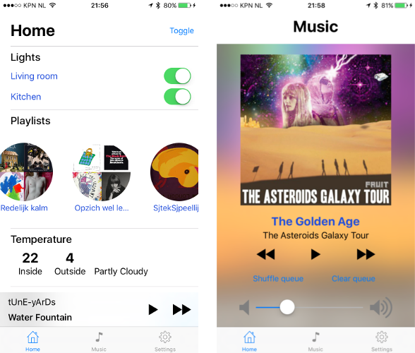

# Sjtek client for iOS

An iOS app for the SjtekControl Core home automation API.

## Screenshots

More screenshots can be found in the [screenshots folder](./Screenshots).

## Documentation
Documentation can be found in de [documentation folder](./Documentation/README.md)